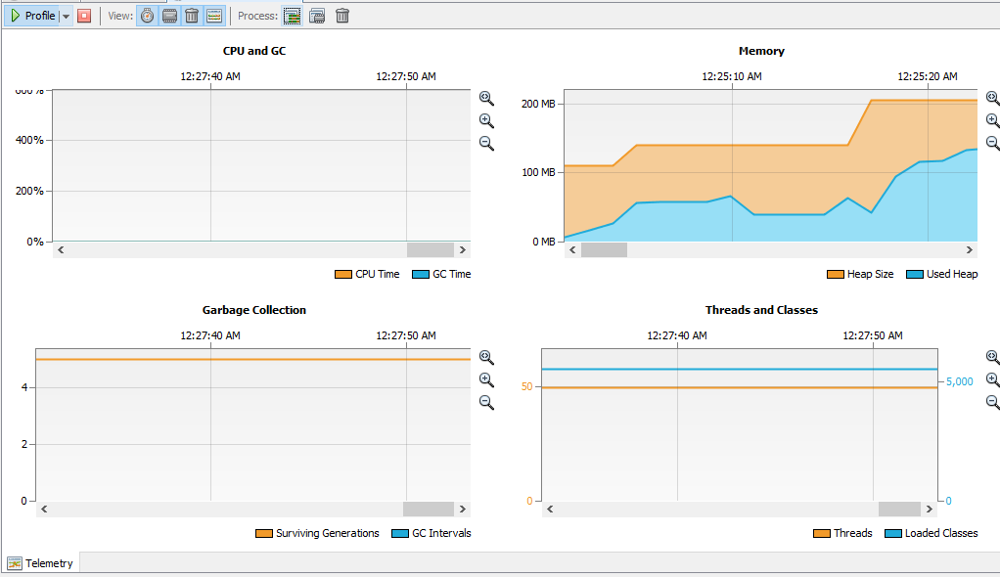
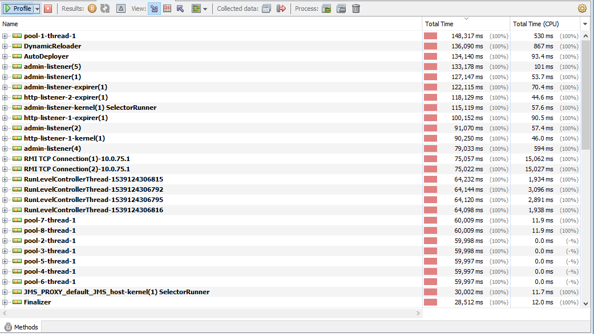
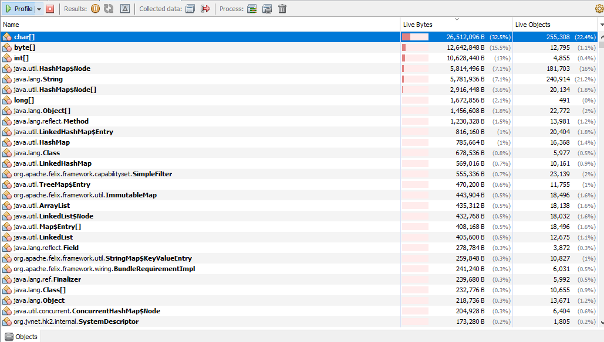

# CodeAnalysisPMD

The last semester project of our group has been used for the exercises:

https://github.com/Ekskursantas/Gutenberg

Exercise 1:
The report produced from PMD is uploaded as an html file.

1. CouplingBetweenObjects - securing the independency of a class that knows as less as possible or nothing about other parts of the project that it doesn't need to.
2. CyclomaticComplexity - indicates the complexity of a program or a method. It directly affect readability and maintanance. 
3. UnnecessaryModifier - Fields in interfaces and annotations are automatically public static final, and methods are public abstract. For cleaner code we could omit some.
4. ShortVariable - we have some short variables as "id" and "db", which could be more elaborate on the specific use of those terms as matter of context to improve readability, for example, in that specific project we use a few different databases.
5. AvoidThrowingNullPointerException - We have to avoid throwing it manually. Exceptions should be used for errors that can occur and not to cover for a faulty method.
6. CloseResource - Ensure that for example a connection is closed when done with use.
7. ClassNamingConventions - Class names should always begin with an upper case.
8. Use ArrayAsList - The java.util.Arrays class has a “asList” method that should be used when you want to create a new List from an array of objects. It is faster than executing a loop to copy all the elements of the array one by one.
9. CommentRequired - It’s required to make comments, as it will help both your self and other programmer to understand the code in the future.
10. OnlyOneReturn - A method should only do one thing, therefore not have multiple returns. 

Exercise 2:

The same project is used in this exercise.

Telemetry:

Methods:

Objects:

